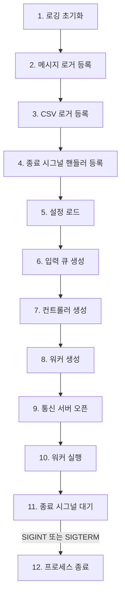
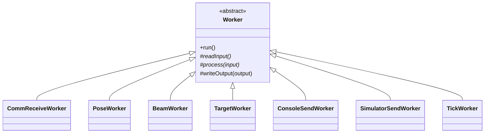

# 실행 제어(`app`) 모듈

## 실행 플로우

```mermaid
flowchart TB
    initializeLogging["1. 로깅 초기화"]
    registerMessageLoggers["2. 메시지 로거 등록"]
    registerCsvLogger["3. CSV 로거 등록"]
    registerShutdownSignalHandlers["4. 종료 시그널 핸들러 등록"]
    loadConfig["5. 설정 로드"]
    createInputQueues["6. 입력 큐 생성"]
    createControllers["7. 컨트롤러 생성"]
    createWorkers["8. 워커 생성"]
    openServer["9. 통신 서버 오픈"]
    startWorkers["10. 워커 실행"]
    waitForShutdownRequest["11. 종료 시그널 대기"]
    exit["12. 프로세스 종료"]

    initializeLogging --> registerMessageLoggers --> registerCsvLogger
    registerCsvLogger --> registerShutdownSignalHandlers --> loadConfig
    loadConfig --> createInputQueues --> createControllers --> createWorkers
    createWorkers --> openServer --> startWorkers --> waitForShutdownRequest
    waitForShutdownRequest -->|SIGINT 또는 SIGTERM| exit
```

## 워커 클래스 다이어그램

```mermaid
classDiagram
    direction TB

    class Worker {
        <<abstract>>
        +run()
        #readInput()*
        #process(input)*
        #writeOutput(output)
    }

    Worker <|-- CommReceiveWorker
    Worker <|-- PoseWorker
    Worker <|-- BeamWorker
    Worker <|-- TargetWorker
    Worker <|-- ConsoleSendWorker
    Worker <|-- SimulatorSendWorker
    Worker <|-- TickWorker
```
