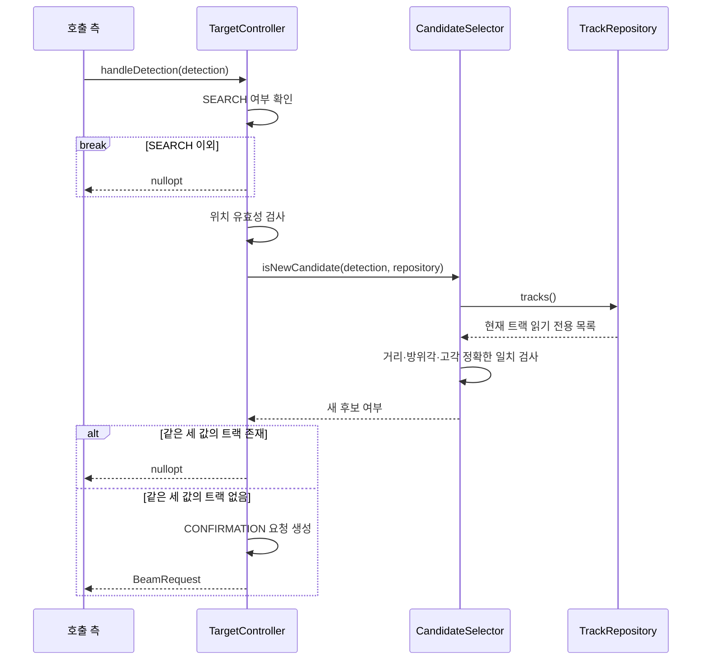
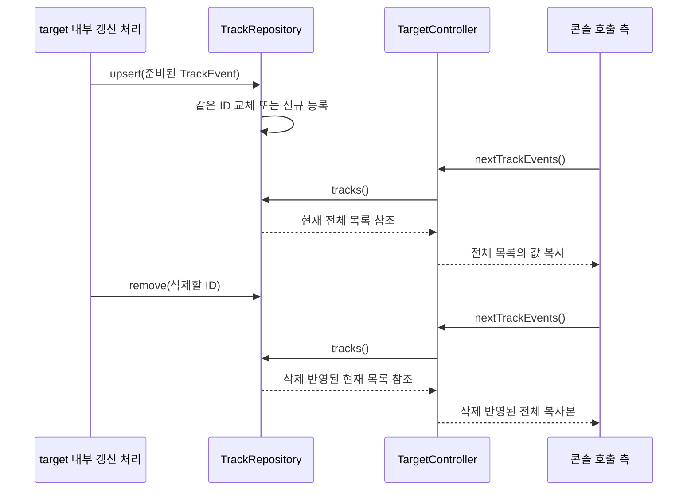

# #20: 탐색 탐지 처리와 전체 트랙 보고

작성 기준: 2026-10-07 한국 시간. 현재 코드의 역할과 실행 순서를 설명한다.
Linux Debug에서 target 테스트 11개와 전체 테스트 106개가 모두 통과했다.
Windows 빌드와 모의기 연동은 아직 검증하지 않았다. 아래 결과는 GitHub 게시 전에 확인했다.

## 현재 구현하는 두 함수

```cpp
std::optional<beam::BeamRequest> handleDetection(DetectionEvent detection);
std::vector<TrackEvent> nextTrackEvents() const;
```

`handleDetection()`은 SEARCH를 현재 등록된 트랙과 비교하며, 거리·방위각·고각 세 값이 모두 같으면 요청을 반환하지 않는다.
그런 트랙이 없으면 원본 안테나 각도로 CONFIRMATION 요청을 반환한다.

**세 값의 정확한 일치는 임시 비교 규칙이다. 물리적으로 같은 표적을 식별하는 완성된 연관 알고리즘이 아니다.**
아주 작은 값 차이도 다른 탐지로 판단한다. 각도 주기 보정·허용 오차·NDS·시각 예측은 없으며 비교용 값은 같은 안테나 좌표계여야 한다.

`nextTrackEvents()`는 Repository에 등록된 모든 트랙의 현재 `TrackEvent`를 복사해 반환한다.
INIT와 TRACKING 모두 포함하며, 이 함수가 조회로 트랙을 삭제하거나 소비하지 않는다.
콘솔 측은 반환받은 벡터 전체를 표시할 수 있다. 콘솔 전송 코드 자체는 이번에 수정하지 않는다.

## 파일별 역할과 유지한 내용

| 파일 | 역할 |
| --- | --- |
| `include/target/controller/target_controller.hpp` | 기존 두 함수 선언 유지, 기본·저장소 공유 생성자 추가 |
| `include/target/dto/detection_event.hpp` | 원래 여섯 필드 그대로 유지 |
| `include/target/dto/track_event.hpp` | 원래 트랙 보고 형식 그대로 유지 |
| `include/target/domain/track_state.hpp` | 기존 enum 그대로 유지 |
| `src/controller/target_controller.cpp` | 입력 검사, 후보 판단 호출, 확인 요청·전체 보고 반환 |
| `src/candidate/candidate_selector.hpp/.cpp` | 저장소를 읽어 세 위치 값이 같은 트랙이 있는지 판단 |
| `src/repository/track_repository.hpp/.cpp` | ID별 현재 트랙 등록·갱신·삭제·조회 |
| `test/target_controller_test.cpp` | 공개 결과와 상태 변경을 검증하는 테스트 |
| `test/search_demo.cpp` | 합성 트랙 등록 후 기존 탐지·다른 거리 탐지·전체 보고를 차례로 출력 |
| `CMakeLists.txt` | 위 구현 파일과 테스트·예제를 빌드에 등록 |

DTO에 source·ID·시각·공분산 필드를 추가하지 않는다. `beam`, `math`, `comm`, `app`도 수정하지 않는다.
사용자가 만들어 둔 나머지 빈 후보·트랙 파일은 빈 상태로 유지하며 빌드에 넣지 않는다.
후보 저장·중복 억제, 확인 결과 처리, 실제 트랙 초기화·필터는 이 단계에 없다.

## 1. Controller를 생성하는 순서

기본 생성자는 `make_shared<TrackRepository>()`로 빈 저장소를 만들고 다른 생성자로 넘긴다.
저장소 공유 생성자는 받은 `shared_ptr`를 `_trackRepository`에 보관한다.
빈 포인터를 넘기면 `std::invalid_argument`를 던진다.

같은 저장소를 target 내부 갱신 처리와 Controller가 공유해야 두 함수가 같은 트랙을 본다.
이를 테스트나 target 내부 연결에서 준비할 때 사용하는 형태는 다음과 같다.

```cpp
auto repository = std::make_shared<target::TrackRepository>();
target::TargetController controller(repository);
// 준비된 TrackEvent를 repository->upsert(trackEvent)로 등록·갱신한다.
```

`TrackRepository`는 내부 헤더에 정의되고 공개 헤더에는 전방 선언만 둔다. `shared_ptr`는 복사본을 만들지 않고 저장소의 수명을 공유한다.
기본 생성자로 만든 빈 저장소는 처음에 보고할 트랙이 없고 모든 유효 SEARCH에 요청을 반환한다.
`handleDetection()`은 탐지만으로 저장소에 트랙을 추가하지 않는다.

## 2. 탐지 입력을 처리하는 실행 순서



1. SEARCH 이외의 입력은 즉시 `std::nullopt`를 반환한다. 확인·추적 결과 처리는 아직 하지 않는다.
2. `validateSearchDetection()`은 거리(m)가 유한한 양수인지 검사한다.
3. 방위각·고각이 유한하며 고각이 -90°부터 +90° 사이인지 검사한다.
4. 실패하면 `std::invalid_argument`를 던진다. Doppler·전력은 현재 비교와 요청 생성에 쓰지 않는다.
5. 지역 `CandidateSelector`를 만들고 같은 저장소를 읽어 새 후보 여부를 판단한다.
6. 기존이면 `nullopt`, 새 후보이면 요청을 만들어 반환한다. 이 과정에서 트랙 목록은 바뀌지 않는다.

Selector의 비교 조건은 다음과 같다. 어느 트랙 하나라도 일치하면 `false`를 반환한다.

```cpp
if (detection.slantRange.m() == track.slantRange.m()
    && detection.azimuth.deg() == track.azimuth.deg()
    && detection.elevation.deg() == track.elevation.deg())
{
    return false;
}
```

전체 목록이 비어 있거나 모든 트랙이 조건 밖이면 마지막에 `true`를 반환한다.
Doppler·전력·트랙 ID는 이 위치 비교 조건에 들어가지 않는다.
수학 기반 연관을 추가할 때 교체할 곳은 `CandidateSelector::isNewCandidate()`의 이 조건이다.
추가 조향 수학 계산은 현재 하지 않는다. 입력이 이미 안테나 각도이므로 요청에 그대로 복사한다.

```cpp
beam::BeamRequest request;
request.beamType = beam::BeamRequest::BeamType::CONFIRMATION;
request.azimuth_ant = detection.azimuth;
request.elevation_ant = detection.elevation;
return request;
```

기존 `BeamRequest`의 기본 `timestamp=0 ms`를 유지한다. 원본 탐지 DTO에는 시각 필드가 없다.
실제 송신 시각을 측정한 값이 아니다. 0 ms의 정확한 스케줄 해석은 빔 모듈 통합 시 정한다.
반환은 요청 생성 완료다. 실제 빔 모듈로 전달하고 송신하는 연결은 호출 측에서 별도로 해야 한다.

## 3. 트랙 갱신과 전체 보고의 실행 순서



`upsert()`는 `find_if`와 ID 비교 람다로 ID를 찾아 그 자리의 `TrackEvent` 전체를 교체하거나 벡터 끝에 신규 추가한다.
여기서 최신이란 가장 최근 `upsert()`로 받은 값이다. timestamp의 대소를 자동 비교하지 않는다.
`remove()`는 ID를 찾아 삭제하고 `true`, 없으면 변경 없이 `false`를 반환한다.
초기 등록·갱신·삭제의 입력을 만드는 실제 트랙 처리 로직은 별도 후속 작업이다.

`tracks()`는 내부 벡터의 `const` 참조를 반환한다. 내부 비교는 목록을 복사하지 않고 읽는다.
반면 Controller의 반환형은 값인 `std::vector<TrackEvent>`이므로 다음 코드가 복사본을 반환한다.

```cpp
std::vector<TrackEvent> TargetController::nextTrackEvents() const
{
    return _trackRepository->tracks();
}
```

ID, 상태, 거리, 각도, Doppler, 위경도, 고도, 속도, 진행각, 비행경로각, timestamp를 모두 그대로 복사한다.
지상거리·위경도·속도·진행각을 이 함수에서 새로 계산하지 않는다.
변경 이벤트 큐가 아니다. 연속 조회하면 삭제되지 않은 트랙 전체가 매번 나온다.
반환된 복사본을 호출 측이 수정해도 저장소의 원본은 바뀌지 않는다.

## 현재 테스트 범위

| 테스트 이름 | 실제 검증 범위 |
| --- | --- |
| `EmptyRepositoryCreatesConfirmationRequest` | 빈 저장소에서 확인 종류·각도·기본 시각·빈 보고 |
| `SamePositionDoesNotCreateRequestRegardlessOfDopplerAndPower` | 세 위치 값이 같으면 Doppler·전력 차이와 관계없이 요청 없음 |
| `DifferentRangeAzimuthOrElevationCreatesRequest` | 거리·방위각·고각 각각이 다르면 요청 있음 |
| `ChecksLaterTracksForMatchingPosition` | 앞 트랙이 달라도 뒤의 같은 위치 트랙을 발견 |
| `TrackEventsReturnsWholeIndependentSnapshotOnEveryCall` | INIT·TRACKING 전체 필드 보존, 반복 조회, 반환 복사본 수정의 독립성 |
| `UpdatedTrackAppearsOnceWithLatestReport` | 같은 ID 갱신 후 보고 하나와 최신 비교, 이전 복사본 보존 |
| `RemovedTrackDisappearsFromSnapshotAndComparison` | 삭제 성공·없는 ID 삭제 실패, 보고와 비교에서 제거 |
| `DetectionHandlingDoesNotChangeStoredTrackReports` | 기존·새 SEARCH 및 확인·추적 입력이 원본 보고를 변경하지 않음 |
| `InvalidSearchRangeIsRejected` | 거리 0·음수·양의 무한대·NaN 거부 |
| `InvalidSearchDirectionIsRejectedAndValidElevationBoundaryIsAccepted` | 방위각·고각 NaN, 고각 ±91° 거부, ±90° 허용, 원본 보고 보존 |
| `NullRepositoryIsRejected` | 빈 shared_ptr로 Controller 생성 시 오류 |

Linux 검증을 집 Windows 빌드·실제 모의기 연동 검증과 구분한다.
아직 구현하지 않은 NDS·필터·후보 수명 테스트는 넣지 않는다.
